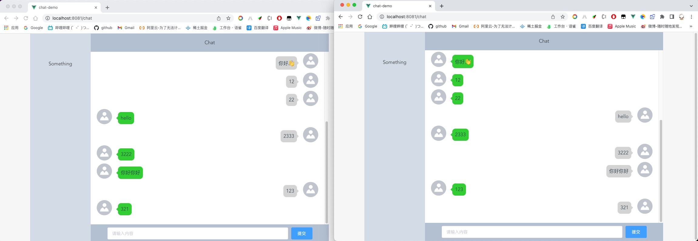

# 腾讯云IM集成Vue2

## 启动

1. 打开签名计算接口服务`user-sign-server`，修改`TengxunyunController`中的应用配置信息

2. 运行Application

3. 进入chat-ui

   ```sh
   npm install
   
   npm run serve
   ```

4. 访问`localhost:8081`

5. 
